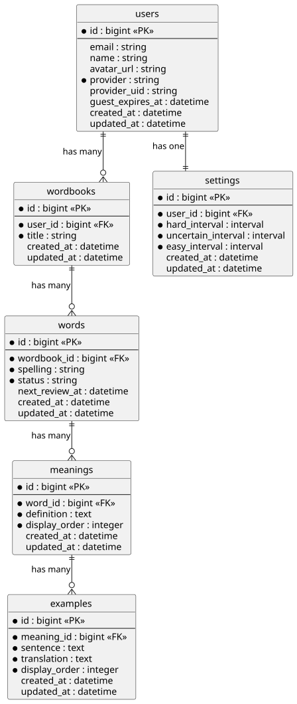

# WordBeetle - 単語帳アプリ

WordBeetleは、効率的な単語学習を実現する間隔反復学習機能を搭載した単語帳アプリケーションです。

## 開発背景

TOEICの学習時に、複数の参考書でわからなかった単語を一元管理したいと考え、開発を始めました。

以下の機能を重視しています：

- 間隔反復学習による効率的な復習
- キーボードで素早く単語を登録できる
- 音声による発音確認

## ER図

